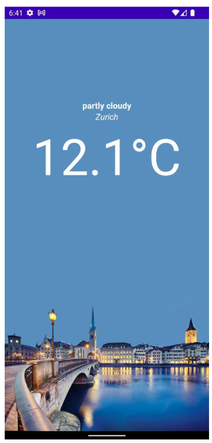

Develop a Weather App layout
Some hints:
• temperature font size is 96.sp, the other two are 16.sp
• location is italic font style
• all three should be centered horizontally
(Modifier.align(Alignment.CenterHorizontally))
• You can find the background image on moodle (or use your own background
image).

